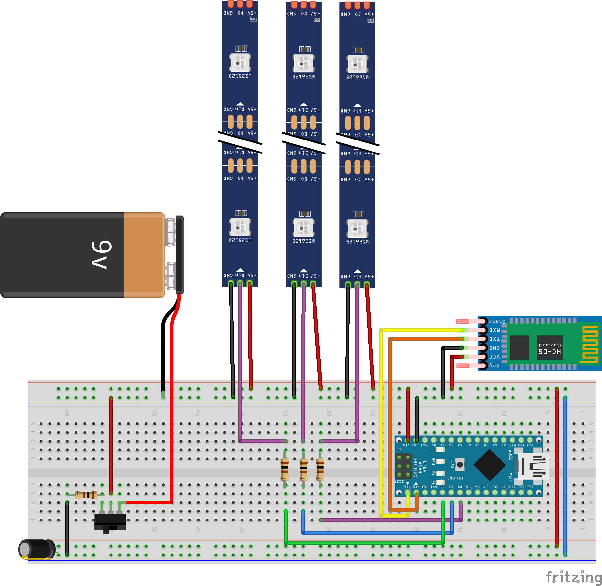

# LightVest

LightVest is an open-source Bike Vest designed to be wearable technology. The product is a Bike Suit designed to increase a cyclist’s visibility, especially during the night. As well as improving cyclist communication and intent with other motorists and pedestrians.

## About this project:

This Bike Safety Product is designed to be open source. Feel free to contribute to make LightVest more robust. LightVest is designed for you to build on top of. Certain aspects of LightVest can be improved. Feel free to contribute, and explore more use cases.

Originally a video idea, aiming to build and launch a start-up in 4 weeks. You can find more information on the process on [smartbuilds.io](https://smartbuilds.io).
Alternatively, you can watch the full start up journey on my YouTube channel for context [Eben Kouao - The 4 Week Start-Up - Mini Documentary](https://www.youtube.com/channel/UCGxwyXJWEarxh2XWqvygiIg).

For more information visit: [lightvest.io](https://lightvest.io)

## Features

- A lightweight Weatherproof LED Vest (with IP67 Rated LEDs)
- Turn Signal’s – Fully programmable RGB LEDs
- Wireless remote to control the lights (with 4 fully customisable buttons)
- A Bike mount to attach to your Bike
- ON/OFF Switch Button
- Go Hand’s Free with an Inbuilt accelerometer – control Turn signals by from your bike handle
- Smart Mode – Send Data and track your Journey by Phone

## LightVest - Resources

This repo contains includes:

- Arduino Code
  - LightVest Remote
  - LightVest Wearable
- Breadboard Schematics (CAD and Fritzing)
  - LightVest Remote
  - LightVest Wearable
- PCB Schematics
  - LightVest Remote
  - LightVest Wearable
- 3D Prints
  - Remote
    - Breadboard Design:
      - Top Case
      - Bottom Case
      - Button (Arrow Keys)
    - PCB Design
      - Top Case
      - Bottom Case
      - Button (Circular)
  - Vest Case
  - L Connector Case

## Functionality of LightVest

| LED Strip            | Colour    | Function                |
| -------------------- | --------- | ----------------------- |
| Diamond Strip - Half | Yellow    | Turn Left or Right      |
| Diamond              | Strip Red | Red Abrupt Break Lights |
| Front Shoulder strip | Yellow    | Turn Left or Right      |
| All LED on Blinking  | Yellow    | Hazard / Emergency      |

## Requirement

Arduino Nano x 2
MPU6050 (Accelerometer)
LED Strip (WS2812B)
Jumper Wires
2 x Bluetooth HC-05

See the full Part List on LightVest's components on [smartbuilds.io](https://smartbuilds.io)

## Diagrams

### LightVest

### Remote

Support my [Future Projects on Patreon](https://www.patreon.com/ebenkouao)
